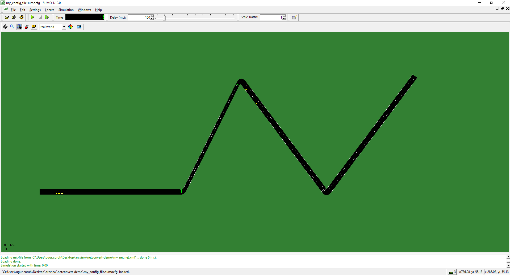
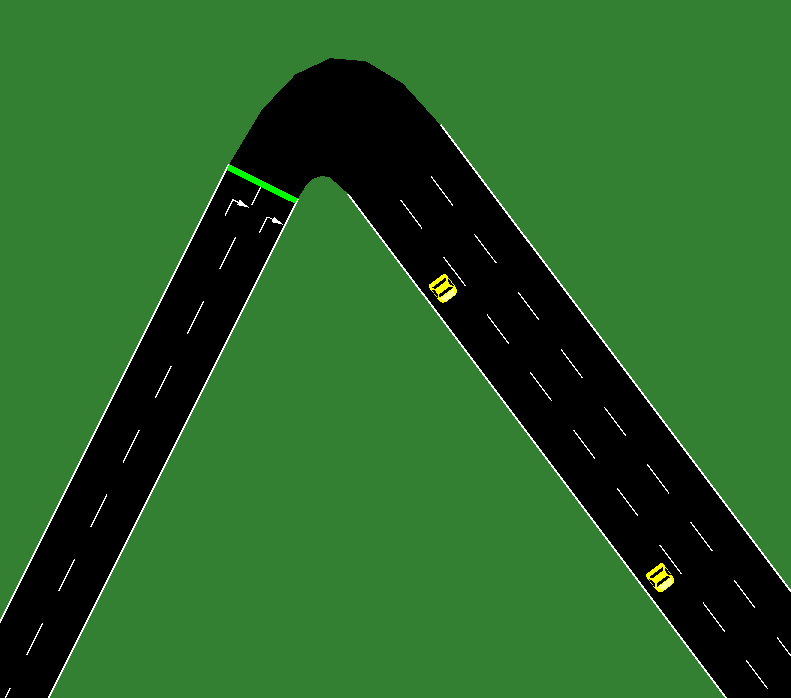

# XML Tanım Dosyaları ile SUMO Dosyalarının Oluşturulması

## 1-Gerekli Dosyalar ve Çalıştırılması

Bu konu sumo sayfasında aşağıdaki şekli ile XML dosyalardan ağ dosyasını oluşturma şekliyle verilmiştir.

[PlainXML - SUMO Documentation](https://sumo.dlr.de/docs/Networks/PlainXML.html)

- kenar (edge, edg.xml dosyası), 

- düğüm (node, node.xml dosyası) 

- yol türü (type, type.xml) dosyaları 

kullanarak aşağıdaki gibi netconvert exesi ile ağ dosyasını (net.xml) dosyasını oluşturabiliriz.

##### run_netconvert.bat

```batch
netconvert --node-files my_node.node.xml --edge-files my_edge.edg.xml -t my_type.type.xml -o my_net.net.xml
pause
```

##### my_node.node.xml

aşağıdaki örnek xml dosyasının nasıl oluşturulduğu ile ilgili ek bilgiler aşağıdaki linkte mevcuttur. 

[PlainXML - SUMO Documentation](https://sumo.dlr.de/docs/Networks/PlainXML.html#node_descriptions)

XML şeması

https://sumo.dlr.de/xsd/nodes_file.xsd

Örnek dosya

```xml
<nodes>
    <node id="n1" x="-500" y="0" type="priority"/>
    <node id="n2" x="-250" y="0" type="traffic_light"/>
    <node id="n3" x="-150" y="200" type="traffic_light"/>
    <node id="n4" x="0" y="0"/>
    <node id="n5" x="150" y="200"/>
</nodes>
```

node id'leri benzersiz olmak zorundadır. type'a göre oluşturulan içerik ve yol kullanımı değişmektedir. 

##### my_edge.edg.xml

edge yani kenarların tanımlarını aşağıdaki linkte bulabilirsiniz

[PlainXML - SUMO Documentation](https://sumo.dlr.de/docs/Networks/PlainXML.html#edge_descriptions)

XML şeması

https://sumo.dlr.de/xsd/edges_file.xsd

Örnek dosya

```xml
<edges>
	<edge from="n1" to="n2" id="1to2" type="3L45"/>
	<edge from="n2" to="n3" id="2to3" type="2L15"/>
	<edge from="n3" to="n4" id="3to4" type="3L30"/>
	<edge from="n4" to="n5" id="out" type="3L30"/>
</edges>
```

##### my_type.type.xml

type yani yol türü tanımlarının yapıldığı dosyadır. Tanımlarını aşağıdaki linkte bulabilirsiniz.

[PlainXML - SUMO Documentation](https://sumo.dlr.de/docs/Networks/PlainXML.html#type_descriptions)


XML Şeması

https://sumo.dlr.de/xsd/types_file.xsd

Örnek dosya

```xml
<types>
	<type id="3L45" priority="3" numLanes="3" speed="45"/>
	<type id="2L15" priority="3" numLanes="2" speed="15"/>
	<type id="3L30" priority="2" numLanes="3" speed="30"/>
</types>
```

## 2-Çıktı Ağ Dosyası

yukarıdaki tanım dosyaları ile netconvert kullanıldığında aşağıdaki ağ dosyasını oluşturaibliriz. netedit ile bu dosyayı açıp düzenleme imkanımız vardır.

##### my_net.net.xml

```xml
<?xml version="1.0" encoding="UTF-8"?>

<!-- generated on 2021-11-21 12:42:53 by Eclipse SUMO netedit Version 1.10.0
<configuration xmlns:xsi="http://www.w3.org/2001/XMLSchema-instance" xsi:noNamespaceSchemaLocation="http://sumo.dlr.de/xsd/netconvertConfiguration.xsd">

    <input>
        <sumo-net-file value="C:\Users\ugur.coruh\Desktop\arcview\netconvert-demo\my_net.net.xml"/>
    </input>

    <output>
        <output-file value="C:\Users\ugur.coruh\Desktop\arcview\netconvert-demo\my_net.net.xml"/>
    </output>

    <processing>
        <geometry.min-radius.fix.railways value="false"/>
        <geometry.max-grade.fix value="false"/>
        <offset.disable-normalization value="true"/>
        <lefthand value="false"/>
    </processing>

    <junctions>
        <no-turnarounds value="true"/>
        <junctions.corner-detail value="5"/>
        <junctions.limit-turn-speed value="5.5"/>
        <rectangular-lane-cut value="false"/>
    </junctions>

    <pedestrian>
        <walkingareas value="false"/>
    </pedestrian>

    <report>
        <aggregate-warnings value="5"/>
    </report>

</configuration>
-->

<net version="1.9" junctionCornerDetail="5" limitTurnSpeed="5.50" xmlns:xsi="http://www.w3.org/2001/XMLSchema-instance" xsi:noNamespaceSchemaLocation="http://sumo.dlr.de/xsd/net_file.xsd">

    <location netOffset="500.00,0.00" convBoundary="0.00,0.00,650.00,200.00" origBoundary="-500.00,0.00,150.00,200.00" projParameter="!"/>

    <type id="2L15" priority="3" numLanes="2" speed="15.00"/>
    <type id="3L30" priority="2" numLanes="3" speed="30.00"/>
    <type id="3L45" priority="3" numLanes="3" speed="45.00"/>

    <edge id=":n2_0" function="internal">
        <lane id=":n2_0_0" index="0" speed="8.25" length="9.78" shape="247.53,-4.80 250.06,-4.50 252.21,-3.58 253.99,-2.06 255.40,0.06"/>
        <lane id=":n2_0_1" index="1" speed="6.70" length="6.22" shape="247.53,-1.60 249.14,-1.41 250.51,-0.83 251.64,0.14 252.54,1.50"/>
    </edge>
    <edge id=":n3_0" function="internal">
        <lane id=":n3_0_0" index="0" speed="5.74" length="9.18" shape="346.27,181.81 347.81,184.06 349.47,184.92 351.26,184.37 353.17,182.44"/>
        <lane id=":n3_0_1" index="1" speed="7.44" length="16.40" shape="343.41,183.24 346.15,187.26 349.12,188.78 352.32,187.82 355.73,184.36"/>
        <lane id=":n3_0_2" index="2" speed="8.16" length="20.04" shape="343.41,183.24 346.91,188.58 350.56,190.86 354.36,190.10 358.29,186.28"/>
    </edge>
    <edge id=":n4_0" function="internal">
        <lane id=":n4_0_0" index="0" speed="7.68" length="15.80" shape="493.60,-4.80 496.80,-8.00 500.00,-9.07 503.20,-8.00 506.40,-4.80"/>
        <lane id=":n4_0_1" index="1" speed="6.09" length="9.48" shape="496.16,-2.88 498.08,-4.80 500.00,-5.44 501.92,-4.80 503.84,-2.88"/>
        <lane id=":n4_0_2" index="2" speed="3.91" length="3.16" shape="498.72,-0.96 499.36,-1.60 500.00,-1.81 500.64,-1.60 501.28,-0.96"/>
    </edge>

    <edge id="1to2" from="n1" to="n2" priority="3" type="3L45">
        <lane id="1to2_0" index="0" speed="45.00" length="247.53" shape="0.00,-8.00 247.53,-8.00"/>
        <lane id="1to2_1" index="1" speed="45.00" length="247.53" shape="0.00,-4.80 247.53,-4.80"/>
        <lane id="1to2_2" index="2" speed="45.00" length="247.53" shape="0.00,-1.60 247.53,-1.60"/>
    </edge>
    <edge id="2to3" from="n2" to="n3" priority="3" type="2L15">
        <lane id="2to3_0" index="0" speed="15.00" length="203.20" shape="255.40,0.06 346.27,181.81"/>
        <lane id="2to3_1" index="1" speed="15.00" length="203.20" shape="252.54,1.50 343.41,183.24"/>
    </edge>
    <edge id="3to4" from="n3" to="n4" priority="2" type="3L30">
        <lane id="3to4_0" index="0" speed="30.00" length="234.04" shape="353.17,182.44 493.60,-4.80"/>
        <lane id="3to4_1" index="1" speed="30.00" length="234.04" shape="355.73,184.36 496.16,-2.88"/>
        <lane id="3to4_2" index="2" speed="30.00" length="234.04" shape="358.29,186.28 498.72,-0.96"/>
    </edge>
    <edge id="out" from="n4" to="n5" priority="2" type="3L30">
        <lane id="out_0" index="0" speed="30.00" length="250.00" shape="506.40,-4.80 656.40,195.20"/>
        <lane id="out_1" index="1" speed="30.00" length="250.00" shape="503.84,-2.88 653.84,197.12"/>
        <lane id="out_2" index="2" speed="30.00" length="250.00" shape="501.28,-0.96 651.28,199.04"/>
    </edge>

    <tlLogic id="n2" type="static" programID="0" offset="0">
        <phase duration="76" state="GG"/>
        <phase duration="9"  state="yy"/>
        <phase duration="5"  state="rr"/>
    </tlLogic>
    <tlLogic id="n3" type="static" programID="0" offset="0">
        <phase duration="82" state="GGG"/>
        <phase duration="3"  state="yyy"/>
        <phase duration="5"  state="rrr"/>
    </tlLogic>

    <junction id="n1" type="dead_end" x="0.00" y="0.00" incLanes="" intLanes="" shape="0.00,0.00 0.00,-9.60"/>
    <junction id="n2" type="traffic_light" x="250.00" y="0.00" incLanes="1to2_0 1to2_1 1to2_2" intLanes=":n2_0_0 :n2_0_1" shape="251.11,2.21 256.83,-0.65 255.33,-3.39 253.81,-5.62 252.27,-7.36 250.71,-8.61 249.13,-9.35 247.53,-9.60 247.53,0.00 249.02,0.25 249.66,0.55 250.22,0.98 250.70,1.54">
        <request index="0" response="00" foes="00" cont="0"/>
        <request index="1" response="00" foes="00" cont="0"/>
    </junction>
    <junction id="n3" type="traffic_light" x="350.00" y="200.00" incLanes="2to3_0 2to3_1" intLanes=":n3_0_0 :n3_0_1 :n3_0_2" shape="359.57,187.24 351.89,181.48 350.36,182.86 349.65,182.98 348.96,182.73 348.32,182.10 347.70,181.10 341.98,183.96 344.70,188.51 347.50,191.45 350.39,192.80 353.36,192.54 356.43,190.69">
        <request index="0" response="000" foes="000" cont="0"/>
        <request index="1" response="000" foes="000" cont="0"/>
        <request index="2" response="000" foes="000" cont="0"/>
    </junction>
    <junction id="n4" type="priority" x="500.00" y="0.00" incLanes="3to4_0 3to4_1 3to4_2" intLanes=":n4_0_0 :n4_0_1 :n4_0_2" shape="500.00,0.00 507.68,-5.76 505.12,-8.60 502.56,-10.31 500.00,-10.88 497.44,-10.31 494.88,-8.60 492.32,-5.76">
        <request index="0" response="000" foes="000" cont="0"/>
        <request index="1" response="000" foes="000" cont="0"/>
        <request index="2" response="000" foes="000" cont="0"/>
    </junction>
    <junction id="n5" type="dead_end" x="650.00" y="200.00" incLanes="out_0 out_1 out_2" intLanes="" shape="657.68,194.24 650.00,200.00"/>

    <connection from="1to2" to="2to3" fromLane="1" toLane="0" via=":n2_0_0" tl="n2" linkIndex="0" dir="l" state="O"/>
    <connection from="1to2" to="2to3" fromLane="2" toLane="1" via=":n2_0_1" tl="n2" linkIndex="1" dir="l" state="O"/>
    <connection from="2to3" to="3to4" fromLane="0" toLane="0" via=":n3_0_0" tl="n3" linkIndex="0" dir="r" state="O"/>
    <connection from="2to3" to="3to4" fromLane="1" toLane="1" via=":n3_0_1" tl="n3" linkIndex="1" dir="r" state="O"/>
    <connection from="2to3" to="3to4" fromLane="1" toLane="2" via=":n3_0_2" tl="n3" linkIndex="2" dir="r" state="O"/>
    <connection from="3to4" to="out" fromLane="0" toLane="0" via=":n4_0_0" dir="l" state="M"/>
    <connection from="3to4" to="out" fromLane="1" toLane="1" via=":n4_0_1" dir="l" state="M"/>
    <connection from="3to4" to="out" fromLane="2" toLane="2" via=":n4_0_2" dir="l" state="M"/>

    <connection from=":n2_0" to="2to3" fromLane="0" toLane="0" dir="l" state="M"/>
    <connection from=":n2_0" to="2to3" fromLane="1" toLane="1" dir="l" state="M"/>
    <connection from=":n3_0" to="3to4" fromLane="0" toLane="0" dir="r" state="M"/>
    <connection from=":n3_0" to="3to4" fromLane="1" toLane="1" dir="r" state="M"/>
    <connection from=":n3_0" to="3to4" fromLane="2" toLane="2" dir="r" state="M"/>
    <connection from=":n4_0" to="out" fromLane="0" toLane="0" dir="l" state="M"/>
    <connection from=":n4_0" to="out" fromLane="1" toLane="1" dir="l" state="M"/>
    <connection from=":n4_0" to="out" fromLane="2" toLane="2" dir="l" state="M"/>

</net>

```

## 3-Rota Planlaması

Rotalar için de tek tek tanımlama yapılabilir. Rota tanımı yapılırken her bir araç için bütün geçeceği güzergah tanımlama ile ifade edilir.

##### my_route.rou.xml

```xml
<routes>
	<vType accel="1.0" decel="5.0" id="Car" length="2.0" maxSpeed="100.0" sigma="0.0" />
    <vType accel="1.0" decel="5.0" id="Bus" length="12.0" maxSpeed="1.0" sigma="0.0" />

    <route id="route0" edges="1to2 2to3"/>
    <vehicle depart="10" id="veh0" route="route0" type="Bus"/>
    <route id="route1" edges="2to3 3to4"/>
    <vehicle depart="10" id="veh1" route="route1" type="Car"/>
    <route id="route2" edges="3to4 out"/>
    <vehicle depart="30" id="veh2" route="route2" type="Car"/>
</routes>
```

## 4-SUMO config dosyasının oluşturulması

Ağ ve rota dosyaları oluşturulduktan sonra aşağıdaki şekli ile sumo için config dosyası oluşturulur ve bununla sumo çalıştırılır.

##### my_config_file.sumocfg

```xml
<configuration>
    <input>
        <net-file value="my_net.net.xml"/>
        <route-files value="my_route.rou.xml"/>
    </input>
    <time>
        <begin value="0"/>
        <end value="2000"/>
    </time>
</configuration>
```

şu şekilde veya direk dosyaya tıklayarak çalıştırılabilir

##### run_sumo.bat

```batch
sumo -c my_config_file.sumocfg
```







