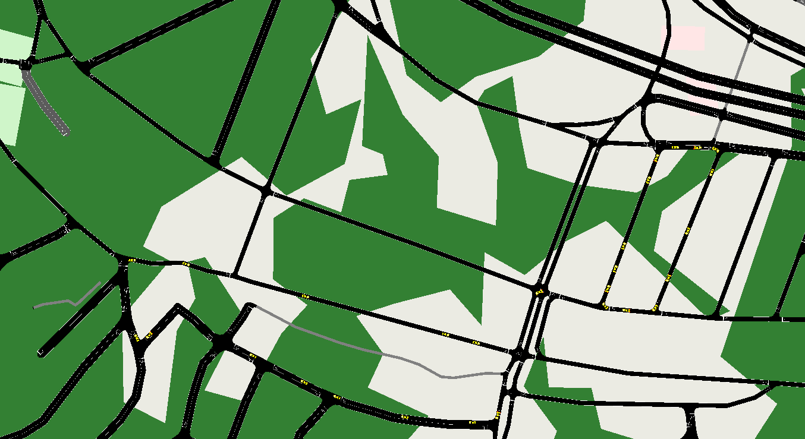

# Kaynak-Hedef Şeklinde Rastgele Rota Oluşturma

Bu çalışma ile rastgele trafik oluşturma işlemini belli bir tanımla kaynak'tan hedef'e giden araç sayısı şeklinde yapacağız.

###### run_od2trips.bat

```batch
od2trips -c od2trips.config.xml -n taz_file.taz.xml -d OD_file.od -o od_file.odtrips.xml
```

Girdi Dosyası

###### od2trips.config.xml (Configuration)

```xml
<configuration>

    <input>
        <taz-files values="taz_file.taz.xml"/>
        <od-matrix-files values="OD_file.od"/>
    </input>

    <!--
    <output>
        <output-filename value="trial.odtrips.xml"/>
    </output>
    -->

</configuration>
```

###### taz_file.taz.xml   (Traffic Analysis Zone)

```xml
<additional>
    <tazs>
        <taz id="1" edges="307329904#1">
        </taz>
        <taz id="2" edges="220285679">
        </taz>
        <taz id="3" edges="220285678#3">
        </taz>
    </tazs>
</additional>
```

###### OD_file.od (Origin Destination)

```c
$O:D2
* From-Time To-Time
0.00 1.00
* Factor
1.00
*
* OD file explainations
* and descriptions
        1        2        10
        1        3        100
        2        3        1000
```

Matrix içindeki sayılar hangi taz id'den hangi taz id'ye ne kadar araç gittiğini ifade etmektedir.

**Çıktı Dosyası**

###### od_file.odtrips.xml

```xml
<?xml version="1.0" encoding="UTF-8"?>

<!-- generated on 2021-11-21 21:01:21 by Eclipse SUMO od2trips Version 1.10.0
<configuration xmlns:xsi="http://www.w3.org/2001/XMLSchema-instance" xsi:noNamespaceSchemaLocation="http://sumo.dlr.de/xsd/od2tripsConfiguration.xsd">

    <input>
        <taz-files value="taz_file.taz.xml"/>
        <od-matrix-files value="OD_file.od"/>
    </input>

    <output>
        <output-file value="od_file.odtrips.xml"/>
    </output>

</configuration>
-->

<routes xmlns:xsi="http://www.w3.org/2001/XMLSchema-instance" xsi:noNamespaceSchemaLocation="http://sumo.dlr.de/xsd/routes_file.xsd">
    <trip id="62" depart="0.79" from="307329904#1" to="220285678#3" fromTaz="1" toTaz="3" departLane="free" departSpeed="max"/>
    <trip id="282" depart="2.83" from="220285679" to="220285678#3" fromTaz="2" toTaz="3" departLane="free" departSpeed="max"/>
    <trip id="518" depart="4.77" from="220285679" to="220285678#3" fromTaz="2" toTaz="3" departLane="free" departSpeed="max"/>
    <trip id="244" depart="11.12" from="220285679" to="220285678#3" fromTaz="2" toTaz="3" departLane="free" departSpeed="max"/>
    <trip id="87" depart="16.72" from="307329904#1" to="220285678#3" fromTaz="1" toTaz="3" departLane="free" departSpeed="max"/>
    <trip id="9" depart="18.39" from="307329904#1" to="220285679" fromTaz="1" toTaz="2" departLane="free" departSpeed="max"/>
    <trip id="748" depart="18.97" from="220285679" to="220285678#3" fromTaz="2" toTaz="3" departLane="free" departSpeed="max"/>
    <trip id="411" depart="19.61" from="220285679" to="220285678#3" fromTaz="2" toTaz="3" departLane="free" departSpeed="max"/>
    <trip id="116" depart="22.71" from="220285679" to="220285678#3" fromTaz="2" toTaz="3" departLane="free" departSpeed="max"/>
    <trip id="390" depart="23.05" from="220285679" to="220285678#3" fromTaz="2" toTaz="3" departLane="free" departSpeed="max"/>
    <trip id="197" depart="36.86" from="220285679" to="220285678#3" fromTaz="2" toTaz="3" departLane="free" departSpeed="max"/>
    <trip id="525" depart="37.70" from="220285679" to="220285678#3" fromTaz="2" toTaz="3" departLane="free" departSpeed="max"/>
    <trip id="141" depart="39.03" from="220285679" to="220285678#3" fromTaz="2" toTaz="3" departLane="free" departSpeed="max"/>
    <trip id="570" depart="46.90" from="220285679" to="220285678#3" fromTaz="2" toTaz="3" departLane="free" departSpeed="max"/>
    <trip id="771" depart="47.95" from="220285679" to="220285678#3" fromTaz="2" toTaz="3" departLane="free" departSpeed="max"/>
    <trip id="542" depart="54.47" from="220285679" to="220285678#3" fromTaz="2" toTaz="3" departLane="free" departSpeed="max"/>
    <trip id="5" depart="55.65" from="307329904#1" to="220285679" fromTaz="1" toTaz="2" departLane="free" departSpeed="max"/>
     ...
</routes>
```

## 3- Trip dosyasından Rota dosyasının oluşturulması

```batch
duarouter -c duarcfg_file.trips2routes.duarcfg -o od_route_file.odtrips.rou.xml
```

##### Girdiler

###### duarcfg_file.trips2routes.duarcfg

```xml
<configuration>
    <input>
        <net-file value="rize.net.xml"/>
        <route-files value="od_file.odtrips.xml"/>
    </input>

    <output>
        <output-file value="od_route_file.odtrips.rou.xml"/>
    </output>

    <report>
        <xml-validation value="never"/>
        <no-step-log value="true"/>
    </report>

</configuration>
```

##### Çıktılar

###### od_route_file.odtrips.rou.xml (bir kısmı)

```xml
<?xml version="1.0" encoding="UTF-8"?>

<!-- generated on 2021-11-21 21:12:14 by Eclipse SUMO duarouter Version 1.10.0
<configuration xmlns:xsi="http://www.w3.org/2001/XMLSchema-instance" xsi:noNamespaceSchemaLocation="http://sumo.dlr.de/xsd/duarouterConfiguration.xsd">

    <input>
        <net-file value="rize.net.xml"/>
        <route-files value="od_file.odtrips.xml"/>
    </input>

    <output>
        <output-file value="od_route_file.odtrips.rou.xml"/>
        <alternatives-output value="od_route_file.odtrips.rou.alt.xml"/>
    </output>

    <report>
        <xml-validation value="never"/>
        <xml-validation.routes value="never"/>
        <no-step-log value="true"/>
    </report>

</configuration>
-->

<routes xmlns:xsi="http://www.w3.org/2001/XMLSchema-instance" xsi:noNamespaceSchemaLocation="http://sumo.dlr.de/xsd/routes_file.xsd">
    <vehicle id="62" depart="0.79" departLane="free" departSpeed="max" fromTaz="1" toTaz="3">
        <route edges="307329904#1 -778936907#12 -778936907#11 -778936907#10 -778936907#9 -220476164 220476169#3 707247680 610262465#1 707247682#1 707247686 707245213#1 220285678#0 220285678#1 220285678#2 220285678#3"/>
    </vehicle>
    <vehicle id="282" depart="2.83" departLane="free" departSpeed="max" fromTaz="2" toTaz="3">
        <route edges="220285679 -612003763#1 -612003763#0 220285681 967234360#6 967234360#7 611398285 611398281 611398277#1 220401030#0 220401030#1 220401030#2 -220959824#3 -220959824#2 -220959824#1 -220959824#0 -220959917#1 -220959917#0 707245214 220285678#2 220285678#3"/>
    </vehicle>
    <vehicle id="518" depart="4.77" departLane="free" departSpeed="max" fromTaz="2" toTaz="3">
        <route edges="220285679 -612003763#1 -612003763#0 220285681 967234360#6 967234360#7 611398285 611398281 611398277#1 220401030#0 220401030#1 220401030#2 -220959824#3 -220959824#2 -220959824#1 -220959824#0 -220959917#1 -220959917#0 707245214 220285678#2 220285678#3"/>
    </vehicle>
    <vehicle id="244" depart="11.12" departLane="free" departSpeed="max" fromTaz="2" toTaz="3">
        <route edges="220285679 -612003763#1 -612003763#0 220285681 967234360#6 967234360#7 611398285 611398281 611398277#1 220401030#0 220401030#1 220401030#2 -220959824#3 -220959824#2 -220959824#1 -220959824#0 -220959917#1 -220959917#0 707245214 220285678#2 220285678#3"/>
    </vehicle>
    <vehicle id="87" depart="16.72" departLane="free" departSpeed="max" fromTaz="1" toTaz="3">
        <route edges="307329904#1 -778936907#12 -778936907#11 -778936907#10 -778936907#9 -220476164 220476169#3 707247680 610262465#1 707247682#1 707247686 707245213#1 220285678#0 220285678#1 220285678#2 220285678#3"/>
    </vehicle>
    <vehicle id="9" depart="18.39" departLane="free" departSpeed="max" fromTaz="1" toTaz="2">
        <route edges="307329904#1 778936907#13 967234362 220285699#0 220285699#1 220285699#2 -612003763#2 -612003763#1 -612003763#0 220285681 967234360#6 220285679"/>
    </vehicle>
```

## 4- SUMO dosyasının oluşturulması

###### rize.sumocfg

```xml
<configuration>
    <input>
        <net-file value="rize.net.xml"/>
        <route-files value="od_route_file.odtrips.rou.xml"/>
        <additional-files value="osm.poly.xml"/>
    </input>
    <time>
        <begin value="0"/>
        <end value="2000"/>
    </time>
</configuration>
```

..



trafik sadece belirlenen yerde akıyor.
